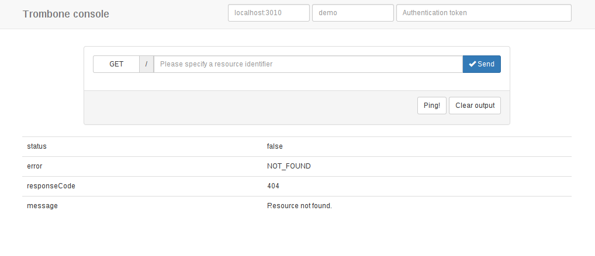

Basic Configuration
===================

Running
-------

To start the service 

* on port 3010 (default),
* with the configuration file ``my.conf``, 
* connecting to the database ``my_database``, 
  
run the following command:

::

    $ trombone -d my_database -r my.conf

Some commonly used flags are:

============= ===================================================
``-C``        enable CORS support
``-r FILE``   specify a (route) configuration file 
``--verbose`` verbose output
``-x``        disable HMAC authentication (for dev. environments)
``-t``        bypass authentication for localhost
============= ===================================================

For a complete list of flags and switches, see `Command Line Flags <command-line-flags.html>`_, or give the following command.

::

    $ trombone --help

Ping
****

To send a ping request to the server, we may then use a command line tool like ``curl``:

::

    $ curl localhost:3010/ping

A typical response (if the service is running):

::

    < HTTP/1.1 200 
    < Transfer-Encoding: chunked
    < Content-Type: application/json; charset=utf-8
    < Server: Trombone/0.8
    {
       "status":true,
       "message":"Pong!"
    }

Console app
***********

Unix signal handlers
--------------------

Trombone responds to ``SIGHUP`` by reloading all configuration data and restarting the service, and to ``SIGTERM`` by shutting down the server after completion of all pending requests.

Example
*******

To send a ``SIGHUP``:

.. sourcecode:: bash

    kill -SIGHUP `ps -a | awk '/trombone/ {print $1}'`

Configuration data storage
--------------------------

..  

As a fallback, the server will look for a database table called ``trombone_config`` in the event that a configuration file is not specified (i.e., the ``-r`` flag is omitted). This comes in handy if you cannot rely on persistent disk storage (e.g. on ephemeral file systems), or simply prefer to keep configuration data in the database. 

::

    CREATE TABLE IF NOT EXISTS trombone_config (
        id   serial                PRIMARY KEY, 
        key  character varying(40) UNIQUE        NOT NULL, 
        val  text                                NOT NULL
    );
 
.. NOTE::
   This table is automatically created when the server starts, unless it already exists.

