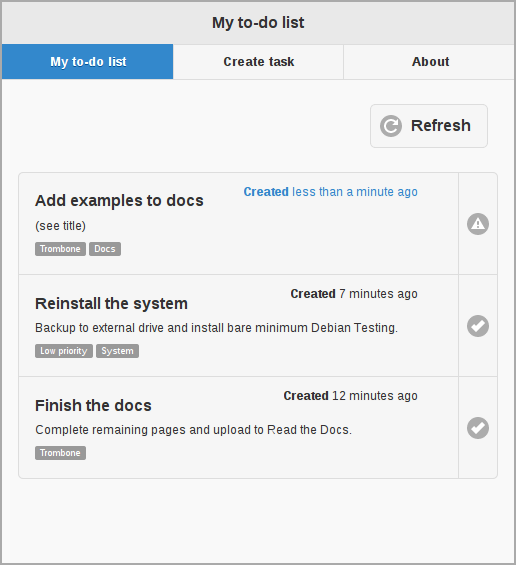

Introduction
============

Trombone facilitates effortless adaptation of conventional SQL schemas to mobile-friendly APIs operating within the RESTful web service paradigm. It uses PostgreSQL as underlying RDBMS and translates JSON-formatted requests to database statements, according to rules layed out by a set of route templates, such as the one below.

.. data exchange

::

    GET resource/:id   ->   SELECT * FROM stuff WHERE id = {{:id}}

This format is `described in more detail here <route-format.html>`_.

Hello, World!
-------------

SQL
***

.. sourcecode:: postgres

    CREATE TABLE tasks (
        id          serial PRIMARY KEY,
        title       character varying(255)       NOT NULL,
        description text                         NOT NULL,
        created     timestamp with time zone     NOT NULL 
    );
    
    CREATE TABLE tags (
        id          serial PRIMARY KEY,
        title       character varying(255)       NOT NULL
    );
    
    CREATE TABLE tasks_tags (
        id          serial PRIMARY KEY,
        task_id     integer                      NOT NULL,
        tag_id      integer                      NOT NULL
    );
    
    INSERT INTO tags (title) VALUES ('Work'), ('Studies'), ('Pastime');
    
    
Configuration file
******************

::

    # Retrieve all tasks, most recent first
    GET    /task  >>  SELECT * FROM tasks ORDER BY created DESC
    
    # Create a new task
    POST   /task  <>  
    
        INSERT INTO tasks 
          ( created
          , title
          , description ) 
        VALUES 
          ( now()
          , {{title}}
          , {{description}} )
    
    # Delete a task
    DELETE /task/:id  --  DELETE FROM tasks WHERE id = {{:id}}
    
    # Update a task
    PUT    /task/:id  ><
    
        UPDATE tasks 
           SET title       = {{title}} 
             , description = {{description}} 
        WHERE 
          id = {{:id}}
    
    # Load all tags
    GET    /tag  >>  SELECT * FROM tags
    
    # Insert a tag
    POST   /tag  <>  INSERT INTO tags (title) VALUES ({{title}})
    
    # Establish a task-tag association
    POST   /tag/task  --  
    
        INSERT INTO tasks_tags 
          ( task_id
          , tag_id ) 
        VALUES 
          ( {{taskId}}
          , {{tagId}} )
    
    # Load task-tag associations for a collection of tasks
    POST   /!tag/task  >>  SELECT * FROM tasks_tags WHERE task_id IN ( {{ids}} )
    

